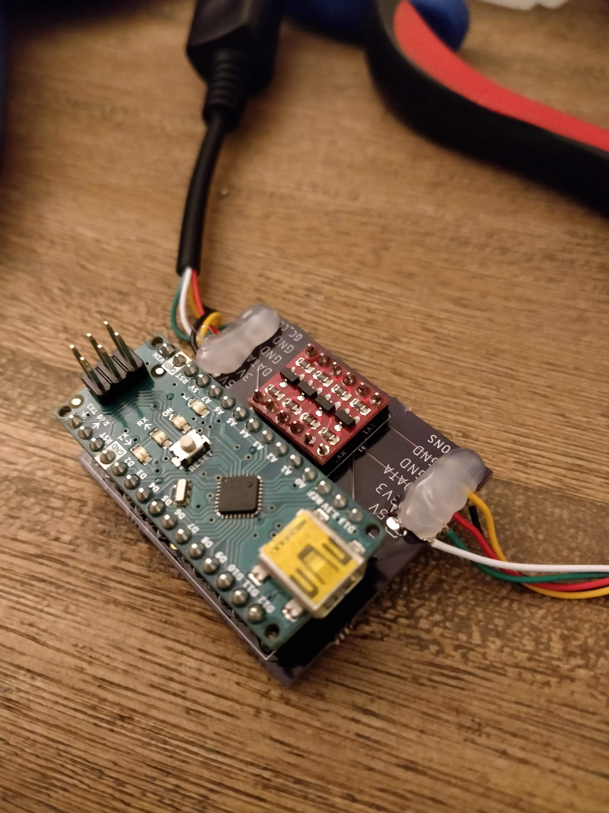

# Secret Agent's Smash Companion
This project implements an in-line Gamecube Controller adapter which can modify GC controller inputs, primarily for practicing against a virtual opponent in Smash Bros. Ultimate (or Melee). The adapter exists in-line with your controller, so you do not need to modify the controller nor the console to use it. The adapter primarily uses an Arduino Nano in conjuction with a logic-level converter to step-down the Arduino Nano's digital logic to the Gamecube's 3.3 V data line.

<p align="center">
  
</p>

## Getting Started
Below are instructions on how to build and upload the code to an Arduino Nano, and how to use the included EAGLE files to get a PCB.

### How to Build and Upload
#### Installing Visual Studio Code
Visual Studio Code was my choice for C++ development. You might have your own preference for IDEs, but this had some nice supportability in inherent functionality and extensions that I found useful. 

You can get Visual Studio Code for free here:
https://code.visualstudio.com/

#### Setting up PlatformIO
I personally found PlatformIO in conjunction with Visual Studio Code to be better than the Arduino IDE for development. Assuming this is expanded to support multiple microcontrollers (ideally with more SRAM), this would make it easy for deployment and testing across a set of enviroments.

PlatformIO can be installed as an extension in Visual Studio Code: https://marketplace.visualstudio.com/items?itemName=platformio.platformio-ide

#### Setting up Nicohood/Nintendo Library
The Nintendo library contains all the APIs for interfacing with the controller and console. You can install it by navigating to the "Libraries" in PlatformIO, searching for the "Nintendo" library, and then selecting "Install".

#### Building and Uploading to the Arduino Nano

Connect your Arduino Nano and click on the PlatformIO icon on Visual Studio Code's Activity bar. Select "Upload" from the "Project Tasks", and PlatformIO will begin to build and upload the code to the connected Arduino.

__NOTE:__ You may have to change the `upload_port` variable in `platformio.ini` to match the Arduino's upload port.

Assuming it builds successfully, your code should be on the Arduino and immediately start running.

### How to Assemble
I included my own designs of a PCB which should make it simple to put together all the necessary parts.

#### Manufacture PCB
I personally like to use OSH Park's 2-layer prototype offering where they will send you 3 PCBs printed from your schematic for a pretty affordable price. For me it was ~12 bucks with shipping, after which it was printed and arrived after 2 weeks.

Link to website: https://oshpark.com/

#### Board Components
Here are the things you should need:
* Official Arduino Nano: https://www.amazon.com/Arduino-A000005-ARDUINO-Nano/dp/B0097AU5OU/
OR
* Arduino Nano Clone: https://www.amazon.com/ELEGOO-Arduino-ATmega328P-Without-Compatible/dp/B0713XK923/ref=sr_1_4?keywords=arduino+nano&qid=1551589218&s=gateway&sr=8-4

__NOTE:__ If you get the Arduino Nano Clone, you may need to change the `board` var in `platformio.ini` depending on its bootloader.

* Bi-directional Logic Level Converter: https://www.sparkfun.com/products/12009
* Gamecube Controller Extension Cable: https://www.amazon.com/gp/product/B001AI7CF2/ref=oh_aui_search_asin_title?ie=UTF8&psc=1
* Header pins (__NOTE:__ should only be needed if the Arduino or the BLLC do not come with header pins already): https://www.sparkfun.com/products/116
* Project box (optional): https://www.amazon.com/gp/product/B00CSRW6UU/ref=ppx_yo_dt_b_asin_title_o00_s00?ie=UTF8&psc=1

#### Assemble Components
Once you have all the parts, you should be able to solder the Arduino Nano and the Bi-directional Logic Level Converter to their header pins, and then directly to the PCB.

For the GC_CONS and GC_CONT pins, you'll have to determine which wires inside of the extension cable corresponds to the pins. There should be 5 wires inside the cable: 5V (for the rumble servo), 3.3V, the Data signal, and two Ground.

There are two methods to determine which ones correspond to which, and both require stripping each individual wire and using a multimeter.

The first method would be to plug in the male-end of the extension cable into a Gamecube (or adapter) and turning it on. Set your multimeter to detect voltage and match each colored wire to its function through the corresponding voltage. The data line should be somewhere between 3.3V and 0V.

The second method would be to set your multimeter to test continuity, then match up each wire to each termination on the female-end of the socket. The document (also linked with other goodies in the Nicohood/Nintendo repo) has an in-depth guide on how to match up the wires with their associated inputs:

http://www.int03.co.uk/crema/hardware/gamecube/_gc-control1.html

For reference, my wires and their corresponding inputs (on the extension cable I linked in the parts list above) given the image in the document above are listed below:
```
Pin 1: White - 5 V
Pin 2: Red - DATA (3.3V)
Pin 3: Yellow - GND
Pin 4: Black - GND
Pin 5: NOT CONN - NOT CONN
Pin 6: Green - 3.3V
Pin 7: NOT CONN - NOT CONN
```
After determining which wires represent which inputs, you should be able to strip the wires and solder them to the board's pins.

I *HIGHLY* recommend using hot glue on the GC_CONS and GC_CONT inputs as the wires are flimsy and can be easily pulled out of the board.

Also, putting the board into a project box will give it further protection. The one I linked above is a transparent, polycarbonate one that I personally used.

#### Connecting to Console
The adapter should work immediately after plugging it into the console, and you should be able to see the controller being detected by the Gamecube/Switch as if it was just another controller. The Arduino Nano's light should be on showing that it's powered.

If you notice that inputs are not going through and the Arduino light is on, press and hold L+R+A+B to reset the controller, and if that doesn't work, try holding X+Y+START as well.

If it still doesn't work, I would recommend uncommenting the `#define DEBUG` directive in `Constants.hpp`, and commenting out the `#define WRITE` directive to triage the controller input reading.

## Usage

Once you've connected the adapter to the console and the controller is sending all inputs to the console successfully, you'll be able to use the training modes listed below.

### General
Each training mode is mapped in some way to the D-Pad inputs. With the adapter plugged in, no D-Pad inputs will be sent to the console, but will instead be how you select between different training modes.

Each D-Pad direction has a number of different training modes associated with it. So, in order to select a specific mode, you have to press the associated D-Pad direction a certain number of times to cycle to the desired mode.

There are two ways to exit the current mode and return to sending all user-inputs through to the console.
The first is to continue to press the D-Pad direction in the same direction as the current mode until you reach the last mode, then press the D-Pad in the direction one last time (e.g. When in the Mash Jump mode, tap D-Pad Left twice).
The second is to press the D-Pad direction in a different direction than the current mode (e.g. tap D-Pad Down when in the Random DI training mode).

The modes bound to each D-Pad input are listed below:

### DI Training (D-Pad Left)

There are two training modes on D-Pad Left:

* Left/Right DI: inputs left and right DI with a neutral analog stick input alternating between them
* Random DI: inputs DI in a random direction with a neutral analog stick input alternating between each random DI input

### Escape Option Training (D-Pad Right)

There are two training modes on D-Pad Right:

* Mash Jump: inputs jumps continuously
* Mash Air-dodge: inputs air-dodge inputs in random directions

### Input Recording and Input Playback (D-Pad Down and D-Pad Up)

In order to record user input, you can press D-Pad Down to start recording, then press any other D-Pad direction to stop, similar to exiting other modes. You can re-record by pressing D-Pad Down again and following the same steps, but only one recording can be stored at a time, so it will overwrite your previously-recorded inputs. Once you're satisfied with your recording, press D-Pad Up to enter the playback recording mode. It will begin to playback your recording and overwrite any inputs into the console. In a similar fashion for exiting other modes, you can press any D-Pad direction to stop playback.

#### Input Recording Architecture

The most complicated part of this project was implementing input recording and playback. I decided to make this a separate section as there will likely be a number of questions involving this piece of functionality.

For storing recordings of input, I decided that the most optimal method would be to store the controller state only when the controller's state changes, rather than the full state of the controller every processor cycle. `InputChangeStore` represents the full recording of the input and is intialized using the initial controller state at the start of the recording along with the time of the initial state. Each processor cycle, the state of the controller is compared with the initial state of the recording. Each time the controller state changes, the new state is then stored as an entry into the array of `InputChange` objects within `InputChangeStore`. Each `InputChange` object stores the full state of the controller along with the total time that controller state should exist. *NOTE*: If the storage capacity for recording is exhausted, this will cause recording mode to be silently exited back into the default pass-through mode. However, whatever was recorded can still be played back.

Playback is achieved by pushing the stored state of the controller to the console every processor cycle. Once the state's time has finished elapsing, the current state index is incremented, and the next controller state is then pushed to the console. Once the recording is finished being played back, it starts over and continues to loop until the playback mode is exited.

##### Tweaking and Caveats

One of the biggest challenges on top of getting the above functionality to work was optimizing the logic in the preivous section so that the Arduino Nano can store in its SRAM a reasonable amount of controller data for training against specific inputs or combos. As all of the variables in this project are statically-allocated, I had to pre-define some constants in `Constants.hpp` to be able to finely tweak the memory usage of the program. The following should be noted for anyone who's looking to further tweak or change input recording.

`ALLOWABLE_AXIS_DRIFT`: This constant defines the minimum value by which any of the 6 axes must change in order to be stored as a new controller state. I noticed that setting this to `0` resulted in the SRAM on the Arduino quickly being used up as my controller seemed to have its axes drift by about `2` or so every frame. Setting this to `2` resulted in tilts or smash attacks also somewhat quickly exhausting the SRAM. If I set this too high, I noticed some specific inputs occasionally becoming smash attacks, so through testing, I opted for `5` having a good balance between accuracy and memory usage. If you're seeing some differences between recording and playback, you can try to reduce this to a lower number.

`MAX_STORE_SIZE`: The total number of `InputChange` objects to store. This is currently set to `180` as it's around the maximum number of objects that can be stored on the Arduino Nano. If you end up adding more constants, classes, etc. to the codebase, this will reduce the total SRAM that the Arduino Nano will have available, and so this variable will have to be reduced. When building the project, PlatformIO should give you a report of how much SRAM is being used by the project. I did noticed through some testing that there seems to be some dynamic allocation done either by the Nintendo library, or something else, so ensuring that there are around 100 bytes left over of SRAM should guarantee that those dynamic resources are allowed to be put into SRAM without locking the program up.

## Specific Configuration Options

Refer to `Constants.hpp` for specific variables which can be used to debug or modify the behavior of the program. 

## How to Add Your Own Training Mode

Training Modes or new Training Groups can be added by extending their respective parent classes using other Training Modes and Groups as templates.

## Utilized Licensed Software

* Nicohood Nintendo Library (see link below for License):
https://github.com/NicoHood/Nintendo

* Arduino Eagle CAD Library (used modified Arduino Nano schematic + board) [GPLv3]:
https://github.com/cyberlink1/Arduino-Eagle-Cad-Library

## Miscellaneous

### Gamecube Controller USB Adapter Compatibility
I have successfully tested this code against an Arduino Nano plugged into a Nintendo Gamecube and the official Nintendo 4-port Gamecube Adapter. While I also tried to test the board against a Mayflash 4-port [W012] adapter, I had no luck. YMMV however as some people have reported some Arduinos using Nicohood's Nintendo library working with the Mayflash adapters.

### Author's Note
Just a heads up, this is my first official open-source, C++, and serious embedded development project, so feel free to send me suggestions and improvements. I primarily have studied and developed in Java, C#, and Python, so C++ has been interesting to work with to say the least.
